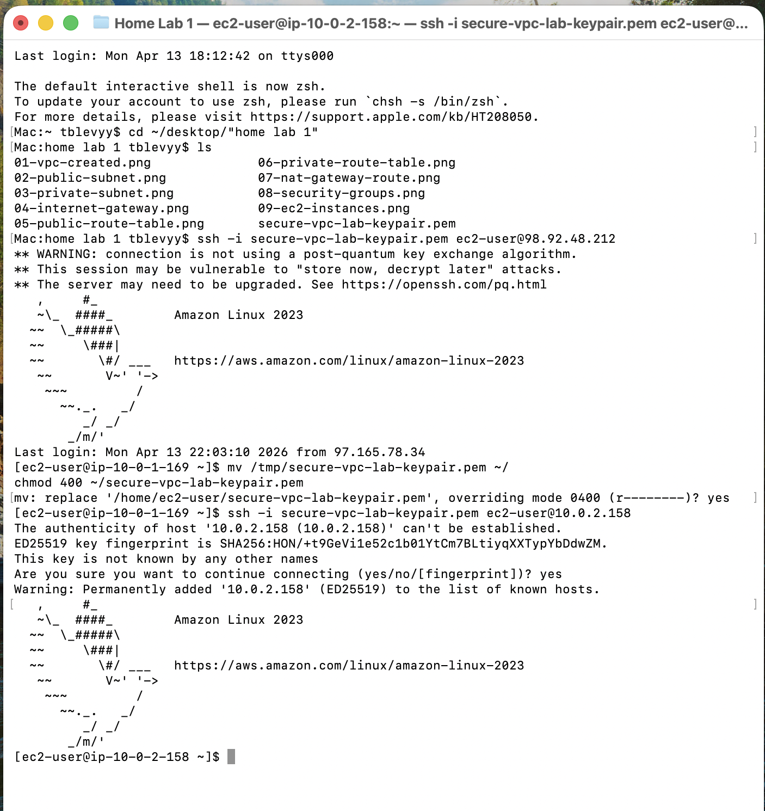

# AWS Secure VPC Lab
Documentation in progress — screenshots and architecture coming soon.

## Step 1 — VPC Creation

Created a new VPC named `secure-vpc-lab-vpc` using CIDR block `10.0.0.0/16`.  
This provides a large address space for multiple subnets and future expansion.

**Screenshot:**  
See `screenshots/01-vpc-created.png`

## Step 2 — Public and Private Subnets

Created two subnets within the VPC:

### Public Subnet
- Name: `public-subnet-1`
- CIDR: `10.0.1.0/24`
- Auto-assign public IPv4 enabled for internet-facing resources

### Private Subnet
- Name: `private-subnet-1`
- CIDR: `10.0.2.0/24`
- No public IP assignment for improved security

**Screenshots:**  
- `screenshots/02-public-subnet.png`  
- `screenshots/03-private-subnet.png`

## Step 3 — Internet Gateway

Created an Internet Gateway (`secure-vpc-lab-igw`) and attached it to the VPC (`secure-vpc-lab-vpc`).  
This enables internet connectivity for resources placed in the public subnet.

**Screenshot:**  
- `screenshots/04-internet-gateway.png`

## Step 4 — Route Tables
Created a public route table (`secure-vpc-lab-rtb-public`) and associated it with the public subnet. Added a default route (`0.0.0.0/0`) pointing to the Internet Gateway to enable outbound internet access for public resources. Created a private route table (`secure-vpc-lab-rtb-private1-us-east-1a`) and associated it with the private subnet for isolated internal routing.

**Screenshots:**  
- `screenshots/05-public-route-table.png`  
- `screenshots/06-private-route-table.png`

  ## Step 5 — NAT Gateway
Created a NAT Gateway (`secure-vpc-lab-natgw`) in the public subnet and attached an Elastic IP address. Updated the private route table to route `0.0.0.0/0` traffic to the NAT Gateway. This allows private subnet resources to securely access the internet for updates and external services without exposing them to inbound public traffic.

**Screenshot:**  
- `screenshots/07-nat-gateway-route.png`

## Step 7 — EC2 Instances
Launched two EC2 instances inside the VPC to complete the public and private compute layers. The public EC2 instance was deployed in the public subnet with a public IP address and assigned the public security group. The private EC2 instance was deployed in the private subnet with no public IP address and assigned the private security group. Both instances use the same key pair for SSH access, ensuring consistent and secure authentication.

Screenshot:
screenshots/09-ec2-instances.png

### Step 8 — SSH Connectivity Test (Public → Private)

In this step, I verified secure connectivity between the public and private EC2 instances. First, I SSH’d into the public EC2 instance from my local machine using the key pair. Then I securely copied the key pair file to the public instance, adjusted its permissions, and used it to SSH into the private EC2 instance using its private IP address. This confirmed that the VPC, subnets, route tables, NAT Gateway, and security groups were all configured correctly. The screenshot shows both SSH sessions in a single terminal window.

